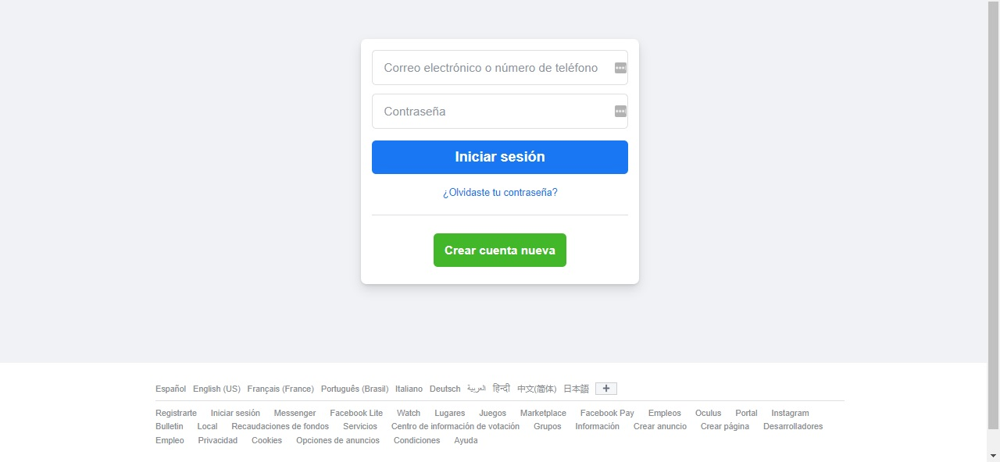
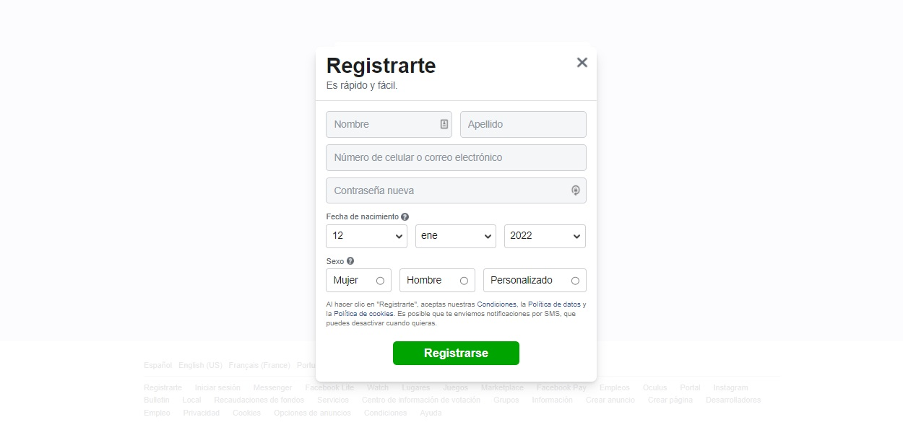

# Facebook Clone

This project is an exact replica or as close as possible to the social network Facebook, which is built in ReactJS and Apollo Server

## Requirements
 * Node JS Version: 16.13.1
 * MongoDB

## Features
### Error codes
* 001 - Database Connection refused
* 002 - Empty field: name
* 003 - Empty field: lastname
* 004 - Empty field: email
* 005 - Empty field: password
* 006 - Empty field: Gender
* 007 - Incorrect date

## Screenshots

Home
Register modal